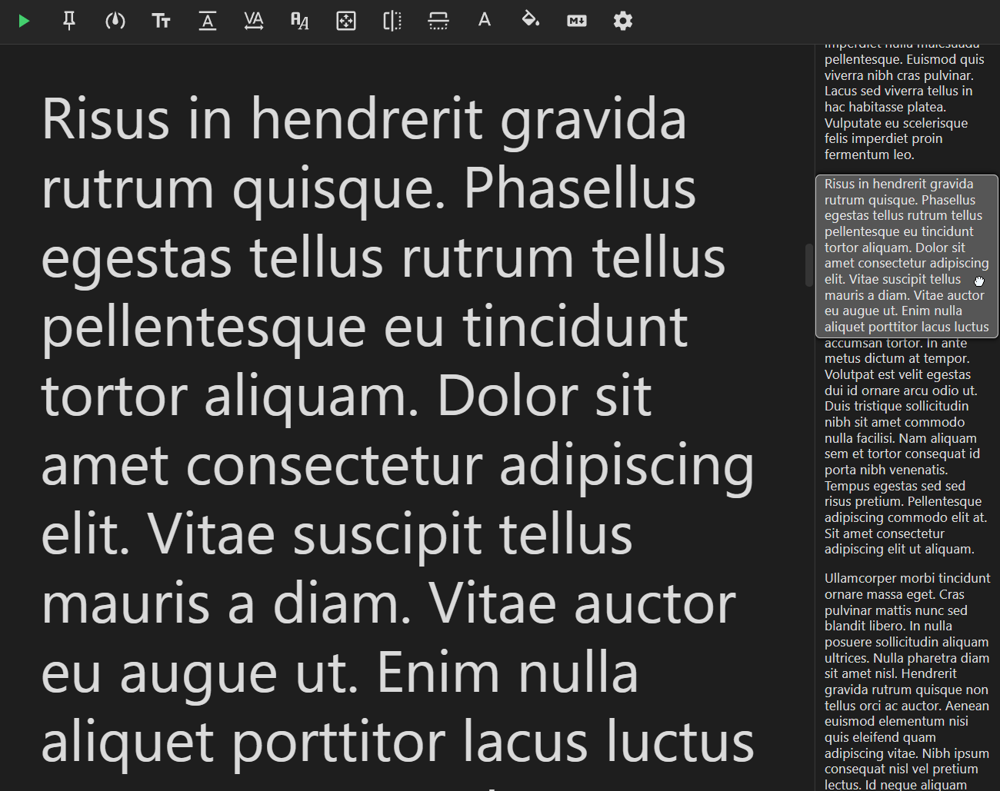

<h1 align="center">Obsidian Teleprompter</h1>

 

  

An Obsidian plugin designed to seamlessly integrate 
teleprompter functionality into your note-taking workflow.

## About the plugin

Open Teleprompter window and focus the note you want to read in Obsidian.
Teleprompter window will display the contents of the note in a large,
easy-to-read format. It will automatically scroll as you read,
allowing you to maintain a steady reading pace.

  

## Features

### Controls

- **Play** - toggle auto-scroll
- **Pin note** - preserve content when switching focus to other notes
- **Speed** - scroll speed
- **Font size** - size of the text
- **Line height** - space between lines
- **Letter spacing** - space between letters
- **Font family** - font used for the text
- **Padding** - space between the text and the edges of the window
- **Flip horizontally** - flip the text horizontally
- **Flip vertically** - flip the text vertically
- **Text color** - color of the text
- **Background color** - color of the background
- **View mode** - choose between 2 different content display modes: "Markdown" or "Plain text"
- **Open settings** - button that opens the plugin's settings

### Panels

You can add as many panels as you want and customize their content, size,
position, and more. The available panels are:

- **Control panel**: Contains a list of controls that you can add, remove, configure, and reorder.
- **Page minimap**: Displays a minimap of the content for
  easy navigation and better context awareness.

### Hotkeys

Use hotkeys for all possible actions within the Teleprompter window.
Every control provides multiple different hotkeys, so you can set up the one that
best suits your case.

## Screenshots

Teleprompter in a separate tab
  

Teleprompter in a separate window

Settings: Panels tab

  
<b>MORE SCREENSHOTS</b>

Settings: Controls tab

Settings: expanded Font size control in the Controls tab

Settings: expanded Control panel in the Panels tab in white theme (if you're into that)

Hotkeys

## Installation

Only manual installation is supported at the moment.

### Manual Installation

1. Download the latest `obsidian-teleprompter.zip` from the latest [Github Release](https://github.com/lumetrium/obsidian-teleprompter/releases)
2. Extract `obsidian-teleprompter` folder from the zip
   to your vault's plugins folder `<vault>/.obsidian/plugins/` (note that `.obsidian` folder may be hidden by default)
3. Restart Obsidian
4. Open "Settings" -> "Community plugins" and activate "Teleprompter"

For details see [the forums](https://forum.obsidian.md/t/plugins-mini-faq/7737).

## Disclosures
In accordance with 
[Obsidian's developer policies](https://docs.obsidian.md/Developer+policies), 
it is required to transparently disclose the presence of any static ads, 
such banners and pop-up messages, within the plugin's interface.

This plugin includes a single [static ad](./assets/screenshots/settings-about.png), 
which is accessible exclusively on the "About" page within the settings. 
The ad is a link to a [project](https://lumetrium.com/definer) developed by the same 
author responsible for this plugin. It's important to emphasize that 
there is no involvement of any third-party advertising.

## Recommendations

Check out this browser extension made by the same author:

**[Definer - Popup Dictionary & Translator](https://lumetrium.com/definer)**  
Instant definitions, translations, and search results for words and phrases you select or type.
