<h1 align="center">Obsidian Teleprompter</h1>

<div align="center">

[](https://github.com/lumetrium/obsidian-teleprompter/releases/latest)  

</div>
<br/>
<p align="center">
  
</p>

<p align="center">
An Obsidian plugin designed to seamlessly integrate<br/>
teleprompter functionality into your note-taking workflow.
</p>

## About the plugin

Open Teleprompter window and focus the note you want to read in Obsidian. Teleprompter window will display the contents of the note in a large, easy-to-read format. It will automatically scroll as you read, allowing you to maintain a steady reading pace.

<p align="center">
  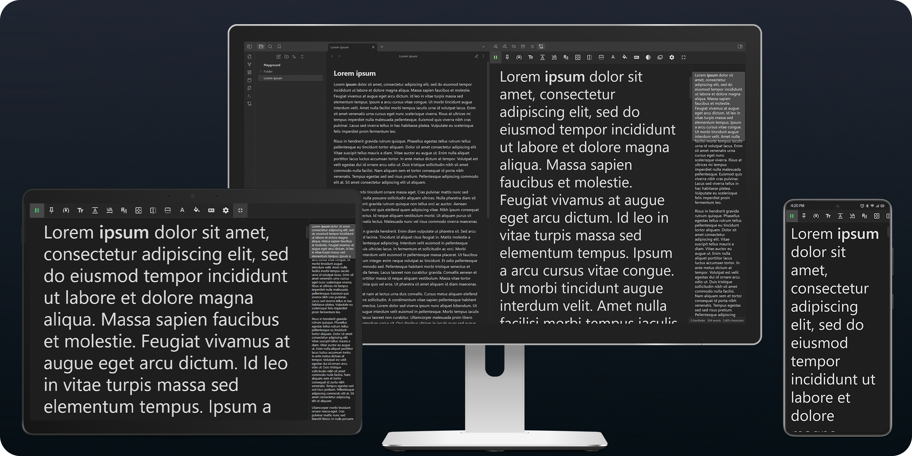
</p>

# Table of contents

- [About the plugin](#about-the-plugin)
- [Screenshots](#screenshots)
- [Features](#features)
  - [Controls](#controls)
    - [Play](#play)
    - [Countdown](#countdown)
    - [Pin note](#pin-note)
    - [Speed](#speed)
    - [Font size](#font-size)
    - [Line height](#line-height)
    - [Letter spacing](#letter-spacing)
    - [Font family](#font-family)
    - [Padding](#padding)
    - [Flip horizontally](#flip-horizontally)
    - [Flip vertically](#flip-vertically)
    - [Text color](#text-color)
    - [Background color](#background-color)
    - [View mode](#view-mode)
    - [Keep awake](#keep-awake)
    - [Detach window](#detach-window)
    - [Opacity](#opacity)
    - [Open settings](#open-settings)
    - [Full-screen](#full-screen)
  - [Panels](#panels)
    - [Control panel](#control-panel)
    - [Page minimap](#page-minimap)
    - [Eyeline indicator](#eyeline-indicator)
  - [Hotkeys](#hotkeys)
    - [Controls hotkeys](#controls-hotkeys)
    - [Content hotkeys](#content-hotkeys)
    - [Additional hotkeys](#additional-hotkeys)
  - [API](#api)
    - [Methods](#methods)
      - [open(params)](#openparams)
      - [close()](#close)
  - [URI](#uri)
- [Installation](#installation)
  - [Quick installation](#quick-installation)
  - [Manual Installation](#manual-installation)
- [Disclosures](#disclosures)
- [Recommendations](#recommendations)

Please note that some of the sections under "Features" contain collapsable content with further details and demos. You can expand them by clicking on their descriptions.

# Screenshots

<p>

Teleprompter in a separate tab of the sidebar:

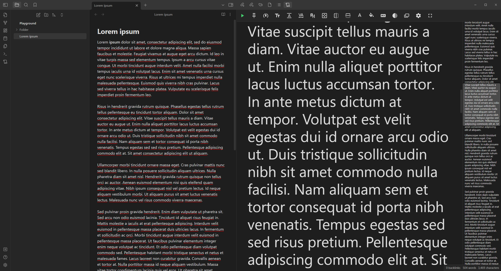


Teleprompter in a separate window:

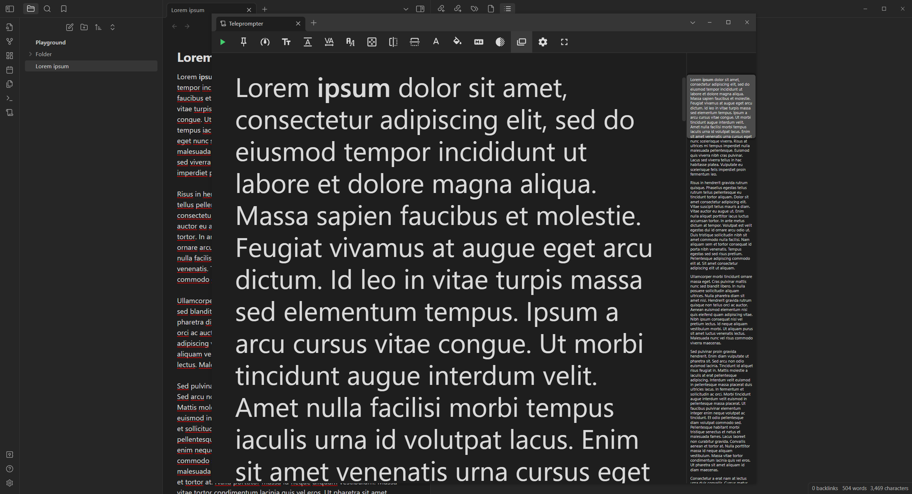


Settings: Panels tab:

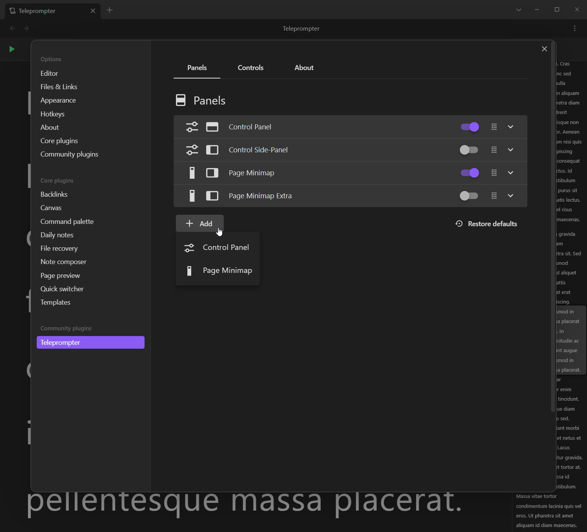

</p>

<details>
  <summary><b>MORE SCREENSHOTS</b></summary>

Settings: Controls tab

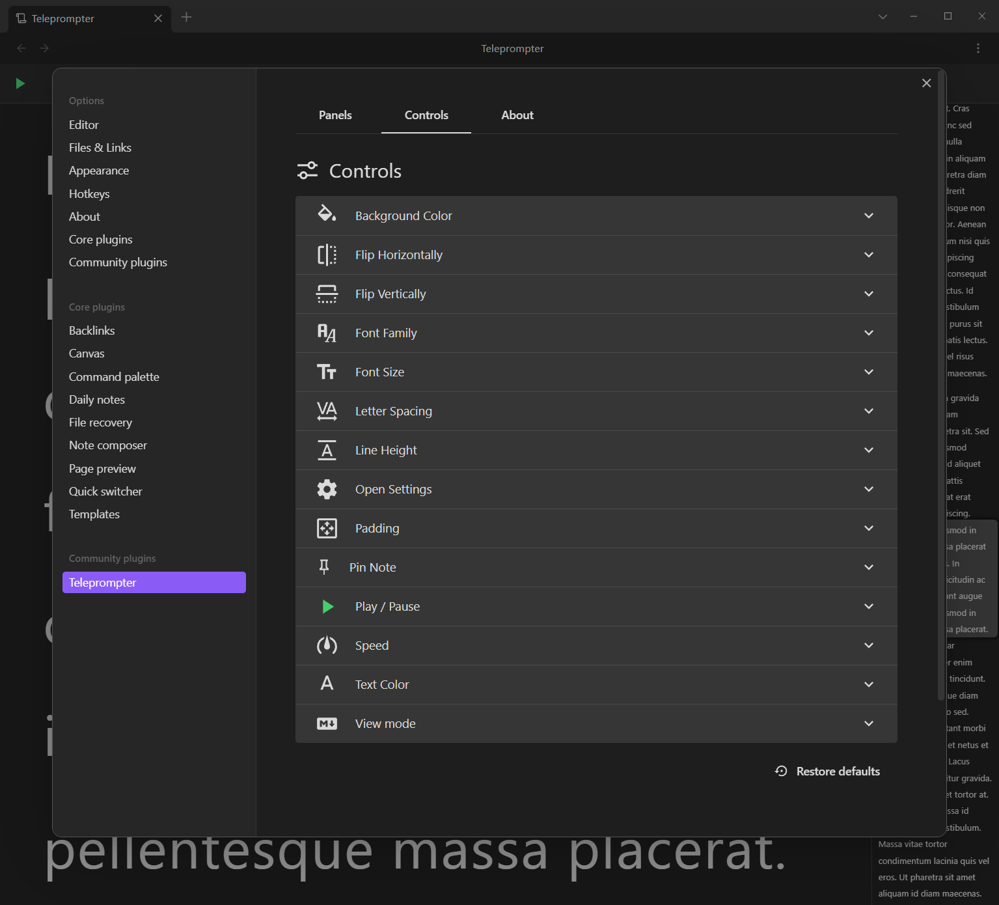

Settings: expanded Font size control in the Controls tab

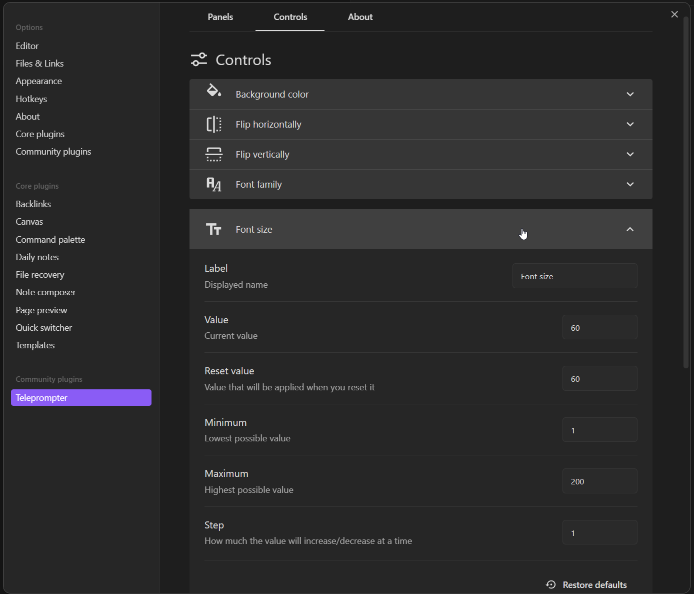

Settings: expanded Control panel in the Panels tab in white theme (if you're into that)

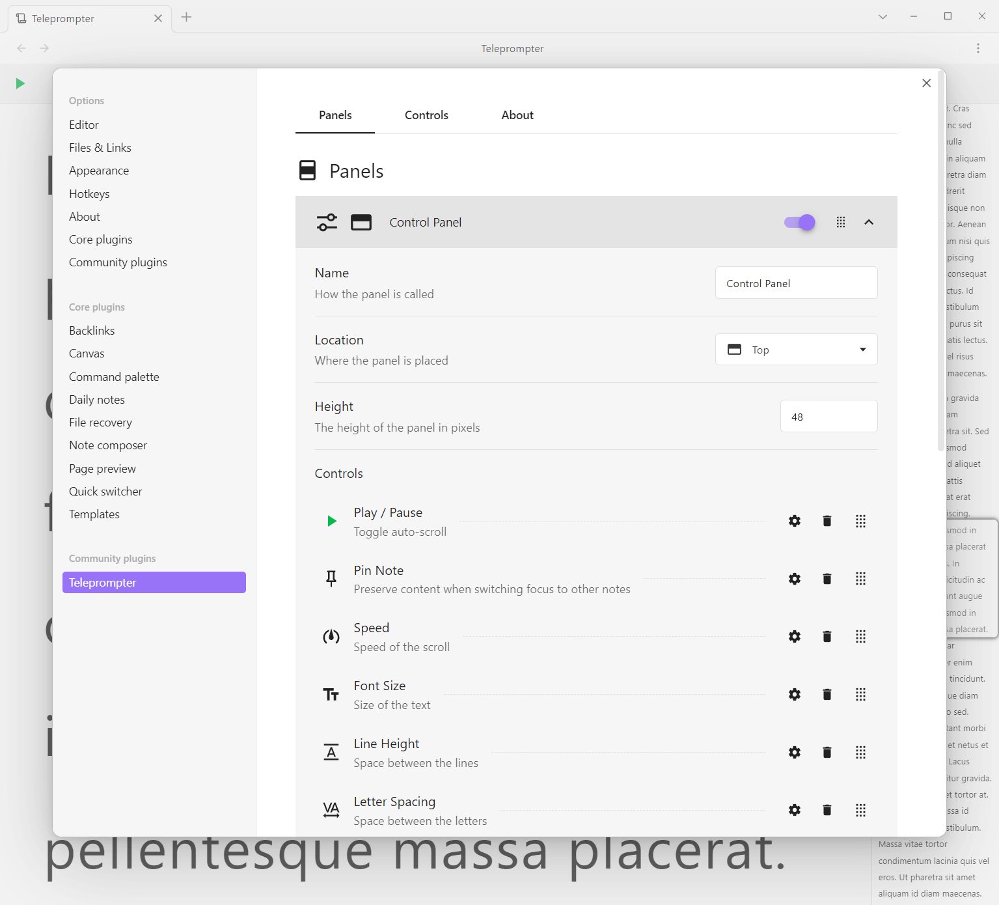

Hotkeys


</details>

See even more screenshots by expanding the sections below. Click on the feature description that you're interested in to view its details and a visual demo.

# Features

Have a feature idea that you believe will take this project to the next level? Don't keep it to yourself; share it with the community by creating a new issue [here](https://github.com/lumetrium/obsidian-teleprompter/issues/new). This will be the place to discuss and document your feature proposal.

## Controls

Controls are interactive elements that you can place on the Control panel. They provide a wide range of customization options, enabling you to tailor their functionality to your specific preferences. Each control offers a set of commands that can be conveniently assigned to hotkeys.

### Play

<details>
  <summary>Toggle auto-scroll</summary>

- When <b style="color: green">enabled</b>, the teleprompter will automatically scroll with set speed.
- When <b style="color: red">disabled</b>, the teleprompter will stop scrolling and wait for you to scroll manually.

---

Commands:
- Toggle (ID: control:play:toggle)
- Toggle on (ID: control:play:true)
- Toggle off (ID: control:play:false)

---

Settings:
- Label: displayed name (default: "Play")
- State: <b style="color: green">enabled</b> / <b style="color: red">disabled</b> (default: <b style="color: red">disabled</b>)
- Active label: displayed label when enabled (default: "Playing")
- Inactive label: displayed label when disabled (default: "Paused")

---

Demo:

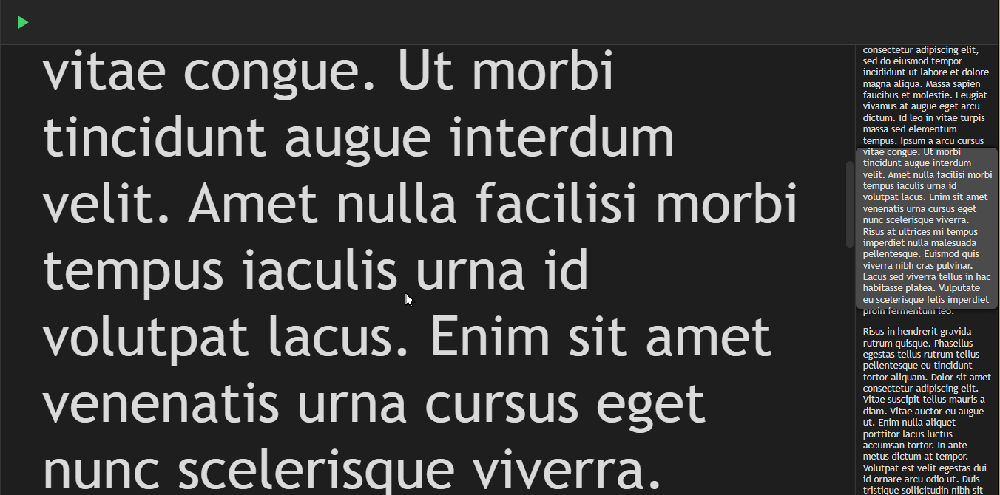

</details>

### Countdown

<details>
  <summary>Set the delay before starting auto-scrolling </summary>

---

Commands:
- Increase with step X (ID: control:countdown:up)
- Decrease with step X (ID: control:countdown:down)
- Reset (ID: control:countdown:reset)
- Reset on pause - toggle (ID: countdown:reset-on-pause:toggle)
- Reset on pause - toggle on (ID: countdown:reset-on-pause:true)
- Reset on pause - toggle off (ID: countdown:reset-on-pause:false)

**step can be configured in the settings*

---

Settings:
- Label: displayed name (default: "Countdown")
- Value: current delay (default: 0, which means no delay before play)
- Reset value: delay that will be applied when you reset it (default: 10)
- Minimum: lowest possible delay (default: 0)
- Maximum: highest possible delay (default: 30)
- Step: how much the value will increase or decrease at a time (default: 1)
- Reset on pause: apply "Reset value" to the countdown on pause (default: Disabled)

---

Demo:


</details>

### Pin note

<details>
  <summary>Preserve content when switching focus to other notes</summary>

- When <b style="color: green">enabled</b>, the teleprompter's content will remain the same when you switch focus to other notes or edit the current note.
- When <b style="color: red">disabled</b>, the teleprompter's content will change to the content of the note you're currently focused on and react to changes made to the note you're viewing.
> Note: Pinned notes do not automatically update in the teleprompter
when the content of the note changes.
---

Commands:
- Toggle (ID: control:pin-note:toggle)
- Toggle on (ID: control:pin-note:true)
- Toggle off (ID: control:pin-note:false)

---
Settings:
- Label: displayed name (default: "Pin note")
- State: <b style="color: green">enabled</b> / <b style="color: red">disabled</b> (default: <b style="color: red">disabled</b>)
- Active label: displayed label when enabled (default: "Pinned")
- Inactive label: displayed label when disabled (default: "Unpinned")

---

Demo:

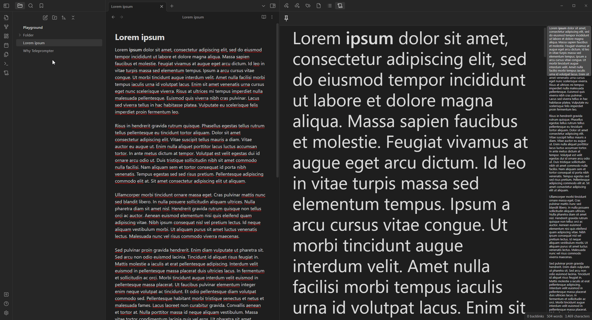

</details>

### Speed

<details>
  <summary>Set the speed at which the teleprompter will scroll</summary>

---

Commands:
- Increase with step X (ID: control:speed:up)
- Decrease with step X (ID: control:speed:down)
- Reset (ID: control:speed:reset)

**step can be configured in the settings*

---

Settings:
- Label: displayed name (default: "Speed")
- Value: current speed (default: 18)
- Reset value: speed that will be applied when you reset it (default: 18)
- Minimum: lowest possible speed (default: 0)
- Maximum: highest possible speed (default: 50)
- Step: how much the value will increase or decrease at a time (default: 1)

---

Demo:


</details>

### Font size

<details>
  <summary>Set the size of the text</summary>

---

Commands:
- Increase with step X (ID: control:font-size:up)
- Decrease with step X (ID: control:font-size:down)
- Reset (ID: control:font-size:reset)

**step can be configured in the settings*

---

Settings:
- Label: displayed name (default: "Font size")
- Value: current font size (default: 60)
- Reset value: font size that will be applied when you reset it (default: 60)
- Minimum: lowest possible font size (default: 1)
- Maximum: highest possible font size (default: 200)
- Step: how much the value will increase or decrease at a time (default: 1)

---

Demo:


</details>

### Line height

<details>
  <summary>Set the space between the lines</summary>

---

Commands:
- Increase with step X (ID: control:line-height:up)
- Decrease with step X (ID: control:line-height:down)
- Reset (ID: control:line-height:reset)

**step can be configured in the settings*

---

Settings:
- Label: displayed name (default: "Line height")
- Value: current line height (default: 1.2)
- Reset value: line height that will be applied when you reset it (default: 1.2)
- Minimum: lowest possible line height (default: 0.7)
- Maximum: highest possible line height (default: 5)
- Step: how much the value will increase or decrease at a time (default: 0.1)

---

Demo:


</details>

### Letter spacing

<details>
  <summary>Set the space between the letters</summary>

---

Commands:
- Increase with step X (ID: control:letter-spacing:up)
- Decrease with step X (ID: control:letter-spacing:down)
- Reset (ID: control:letter-spacing:reset)

**step can be configured in the settings*

---

Settings:
- Label: displayed name (default: "Letter spacing")
- Value: current letter spacing (default: 0, which means normal)
- Reset value: letter spacing that will be applied when you reset it (default: 0)
- Minimum: minimum letter spacing (default: -5)
- Maximum: highest possible letter spacing (default: 10)
- Step: how much the value will increase or decrease at a time (default: 0.05)


---

Demo:

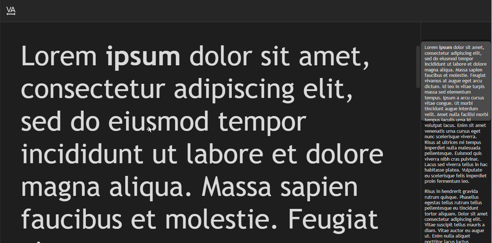

</details>

### Font family

<details>
  <summary>Set the font used for the text</summary>

---

Commands:
- Reset (ID: control:font-family:reset)

---

Settings:
- Label: displayed name (default: "Font family")
- Value: current font family (default: "Default")
- Reset value: font family that will be applied when you reset it (default: "Default")

---

Options:
- Default
- Arial
- Courier New _(monospaced)_
- Georgia
- Helvetica
- Times New Roman
- Trebuchet MS
- Tahoma
- Roboto
- Verdana

---

Demo:


</details>

### Padding

<details>
  <summary>Set the space between the text and the edges of the window</summary>

---

Commands:
- Top - increase with step X (ID: control:padding:0:up)
- Top - decrease with step X (ID: control:padding:0:down)
- Top - reset (ID: control:padding:0:reset)


- Right - increase with step X (ID: control:padding:1:up)
- Right - decrease with step X (ID: control:padding:1:down)
- Right - reset (ID: control:padding:1:reset)


- Bottom - increase with step X (ID: control:padding:2:up)
- Bottom - decrease with step X (ID: control:padding:2:down)
- Bottom - reset (ID: control:padding:2:reset)


- Left - increase with step X (ID: control:padding:3:up)
- Left - decrease with step X (ID: control:padding:3:down)
- Left - reset (ID: control:padding:3:reset)

**step can be configured in the settings*

---

Settings:
- Top
  - Label: displayed name (default: "Top")
  - Value: current top padding (default: 50%)
  - Reset value: top padding that will be applied when you reset it (default: 50%)
  - Minimum: lowest possible top padding (default: 0%)
  - Maximum: highest possible top padding (default: 100%)
  - Step: how much the value will increase or decrease at a time (default: 1%)
- Right
  - Label: displayed name (default: "Right")
  - Value: current right padding (default: 5%)
  - Reset value: right padding that will be applied when you reset it (default: 5%)
  - Minimum: lowest possible right padding (default: 0%)
  - Maximum: highest possible right padding (default: 100%)
  - Step: how much the value will increase or decrease at a time (default: 1%)
- Bottom
  - Label: displayed name (default: "Bottom")
  - Value: current bottom padding (default: 50%)
  - Reset value: bottom padding that will be applied when you reset it (default: 50%)
  - Minimum: lowest possible bottom padding (default: 0%)
  - Maximum: highest possible bottom padding (default: 100%)
  - Step: how much the value will increase or decrease at a time (default: 1%)
- Left
  - Label: displayed name (default: "Left")
  - Value: current left padding (default: 5%)
  - Reset value: left padding that will be applied when you reset it (default: 5%)
  - Minimum: lowest possible left padding (default: 0%)
  - Maximum: highest possible left padding (default: 100%)
  - Step: how much the value will increase or decrease at a time (default: 1%)

---

Demo:

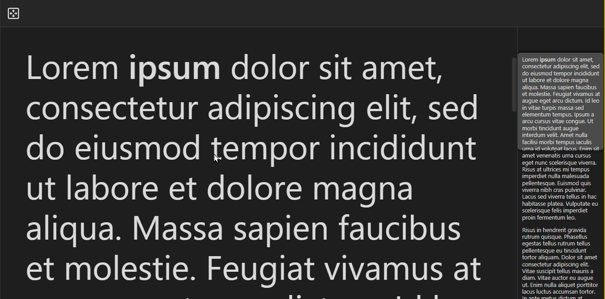

</details>

### Flip horizontally

<details>
  <summary>Flip the text horizontally</summary>

- When <b style="color: green">enabled</b>, the text will be flipped along the X-axis.
- When <b style="color: red">disabled</b>, the text will be displayed normally.

---

Commands:
- Toggle (ID: control:flip-x:toggle)
- Toggle on (ID: control:flip-x:true)
- Toggle off (ID: control:flip-x:false)

---

Settings:
- Label: displayed name (default: "Flip horizontally")
- State: <b style="color: green">enabled</b> / <b style="color: red">disabled</b> (default: <b style="color: red">disabled</b>)
- Active label: displayed label when enabled (default: "Flipped")
- Inactive label: displayed label when disabled (default: "")

---

Demo:


</details>

### Flip vertically

<details>
  <summary>Flip the text vertically</summary>

- When <b style="color: green">enabled</b>, the text will be flipped along the Y-axis.
- When <b style="color: red">disabled</b>, the text will be displayed normally.

---

Commands:
- Toggle (ID: control:flip-y:toggle)
- Toggle on (ID: control:flip-y:true)
- Toggle off (ID: control:flip-y:false)

---

Settings:
- Label: displayed name (default: "Flip vertically")
- State: <b style="color: green">enabled</b> / <b style="color: red">disabled</b> (default: <b style="color: red">disabled</b>)
- Active label: displayed label when enabled (default: "Flipped")
- Inactive label: displayed label when disabled (default: "")

---

Demo:

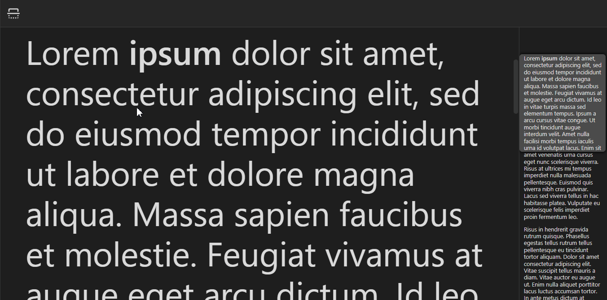

</details>

### Text color

<details>
  <summary>Set the color of the text</summary>

---

Commands:
- Reset (ID: control:text-color:reset)

---

Settings:
- Label: displayed name (default: "Text color")
- Value: current text color (default: Obsidian's text color)

---

Demo:


</details>

### Background color

<details>
  <summary>Set the color of the background</summary>

---

Commands:
- Reset (ID: control:bg-color:reset)

---

Settings:
- Label: displayed name (default: "Background color")
- Value: current background color (default: Obsidian's background color)

---

Demo:


</details>

### View mode

<details>
  <summary>Choose between 2 different content display modes: "Markdown" or "Plain text"</summary>

---

Commands:
- Reset (ID: control:content:reset)

---

Settings:
- Label: displayed name (default: "View mode")
- Value: current view mode (default: "Markdown")
- Reset value: view mode that will be applied when you reset it (default: "Markdown")

---

Options:
- Markdown
- Plain text

---

Demo:

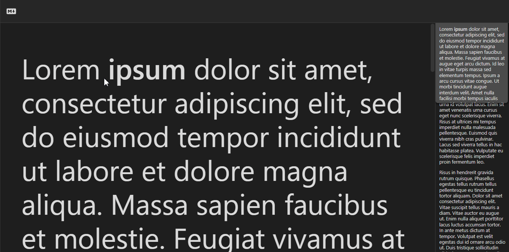

</details>

### Keep awake

<details>
  <summary>Prevent display from going to sleep</summary>

- When <b style="color: green">enabled</b>, the display will not turn off while the teleprompter is open.
- When <b style="color: red">disabled</b>, the display will turn off according to your system's settings.

---

Commands:
- Toggle (ID: control:wake-lock:toggle)
- Toggle on (ID: control:wake-lock:true)
- Toggle off (ID: control:wake-lock:false)

---

Settings:
- Label: displayed name (default: "Keep awake")
- State: <b style="color: green">enabled</b> / <b style="color: red">disabled</b> (default: <b style="color: green">enabled</b>)
- Active label: displayed label when enabled (default: "Active")
- Inactive label: displayed label when disabled (default: "")

</details>

### Detach window

> 📵 This feature is not available on mobile.

<details>
  <summary>Move the teleprompter to a new window</summary>

- Upon <b style="color: green">enabling</b>, the teleprompter will be moved to a new window.
- Upon <b style="color: red">disabling</b>, the teleprompter will be moved to the main Obsidian window.

---

Commands:

- Toggle (ID: control:detach-window:toggle)
- Toggle on (ID: control:detach-window:true)
- Toggle off (ID: control:detach-window:false)

---

Settings:
- Label: displayed name (default: "Detach window")
- State: <b style="color: green">enabled</b> / <b style="color: red">disabled</b> (default: <b style="color: red">disabled</b>)
- Active label: displayed label when enabled (default: "Detached")
- Inactive label: displayed label when disabled (default: "")

---

Demo:

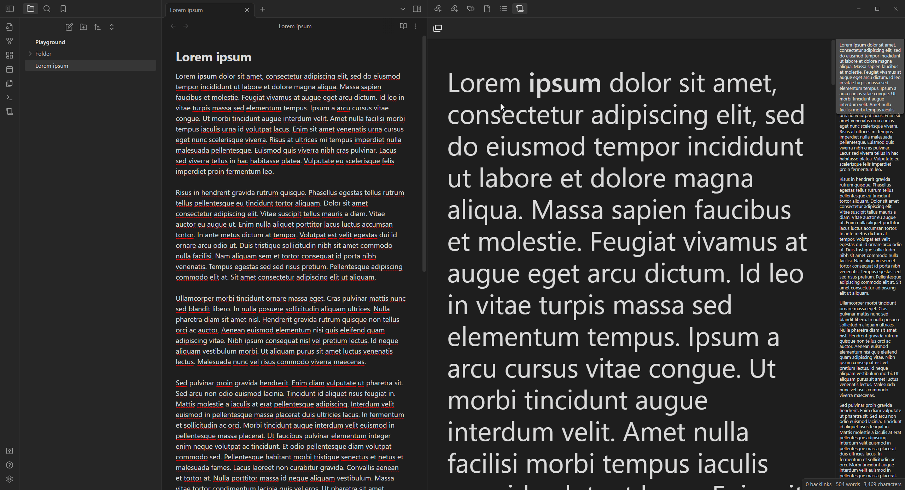

</details>

### Opacity

> 📵 This feature is not available on mobile.

<details>
  <summary>Make the teleprompter window semi-transparent (desktop only)</summary>

---

Commands:

- Increase with step X (ID: control:opacity:up)
- Decrease with step X (ID: control:opacity:down)
- Reset (ID: control:opacity:reset)

**step can be configured in the settings*

---

Settings:
- Label: displayed name (default: "Opacity")
- Value: current opacity (default: 100%)
- Reset value: opacity that will be applied when you reset it (default: 100%)
- Minimum: lowest possible opacity (default: 40%)
- Maximum: highest possible opacity (default: 100%)
- Step: how much the value will increase or decrease at a time (default: 1%)

---

Demo:

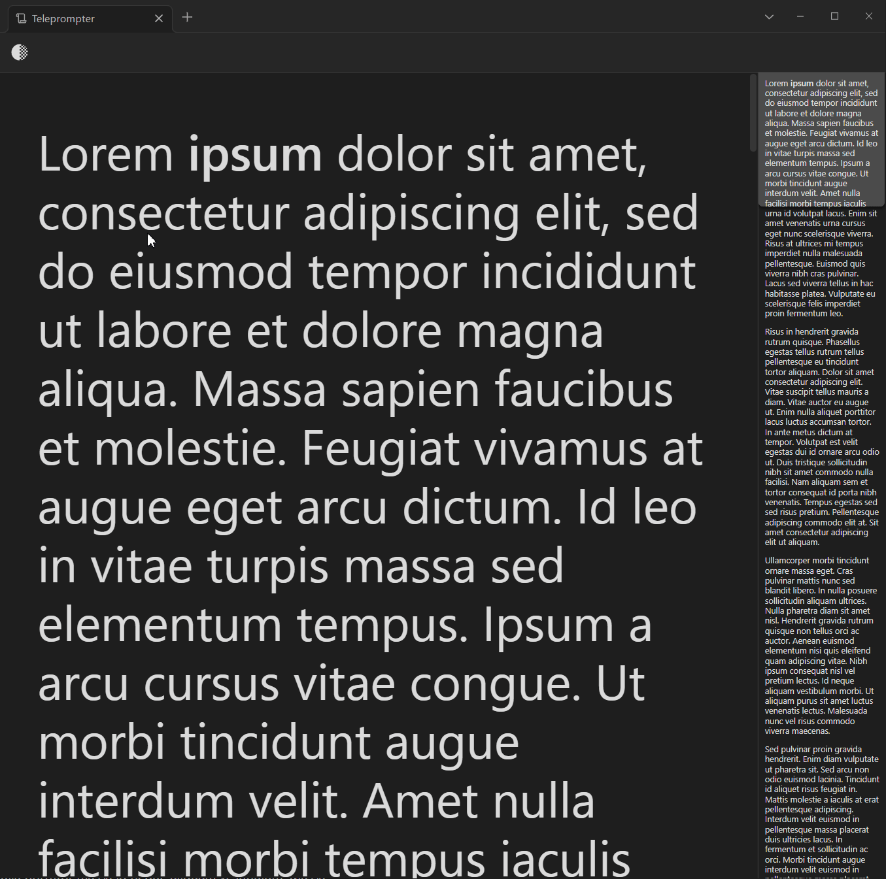

</details>

### Open settings

<details>
  <summary>Use a button to quickly open plugin's settings</summary>

---

Commands:
- Open settings (ID: control:open-settings:trigger)

---

Settings:
- Label: displayed name (default: "Open settings")

---

Demo:

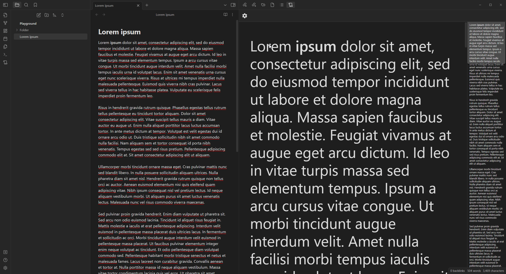

</details>

### Full-screen

<details>
  <summary>Maximize the teleprompter's view</summary>

- Upon <b style="color: green">enabling</b>, the teleprompter will be maximized to fill the entire screen.
- Upon <b style="color: red">disabling</b>, the teleprompter will be restored to its original size.

---

Commands:

- Toggle (ID: control:fullscreen:toggle)
- Toggle on (ID: control:fullscreen:true)
- Toggle off (ID: control:fullscreen:false)

---

Settings:
- Label: displayed name (default: "Full-screen")
- State: <b style="color: green">enabled</b> / <b style="color: red">disabled</b> (default: <b style="color: red">disabled</b>)
- Active label: displayed label when enabled (default: "Active")
- Inactive label: displayed label when disabled (default: "")

---

Demo:

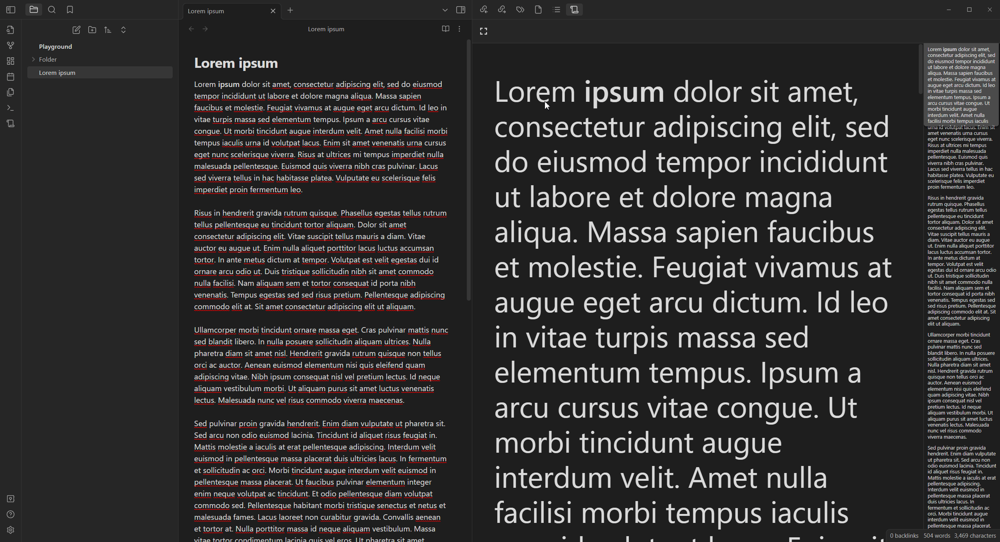

</details>

## Panels

Panels are versatile containers, available in both vertical and horizontal orientations, that you can insert into the Teleprompter window to showcase a variety of controls and additional information. You can add as many panels as you need and tailor their content, dimensions, positioning, and other attributes to match your specific requirements.

Currently, there are two types of panels available:

### Control panel

<details>
  <summary>Contains a list of controls that you can add, remove, reorder, and configure.</summary>

---

Settings:
- Name: displayed name (default: "Control panel")
- Location: where the panel is placed (default: "Top")
  - Top
  - Bottom
  - Left
  - Right
- Width: width of the panel (default: 250 pixels), only for "Left" and "Right" locations
- Height: height of the panel (default: 48 pixels), only for "Top" and "Bottom" locations
- Alignment: alignment of the panel (default: "Center"), only for "Left" and "Right" locations
  - Default
  - Center
  - Left
  - Right
- Controls: list of controls that will be displayed in the panel

---

Demo:


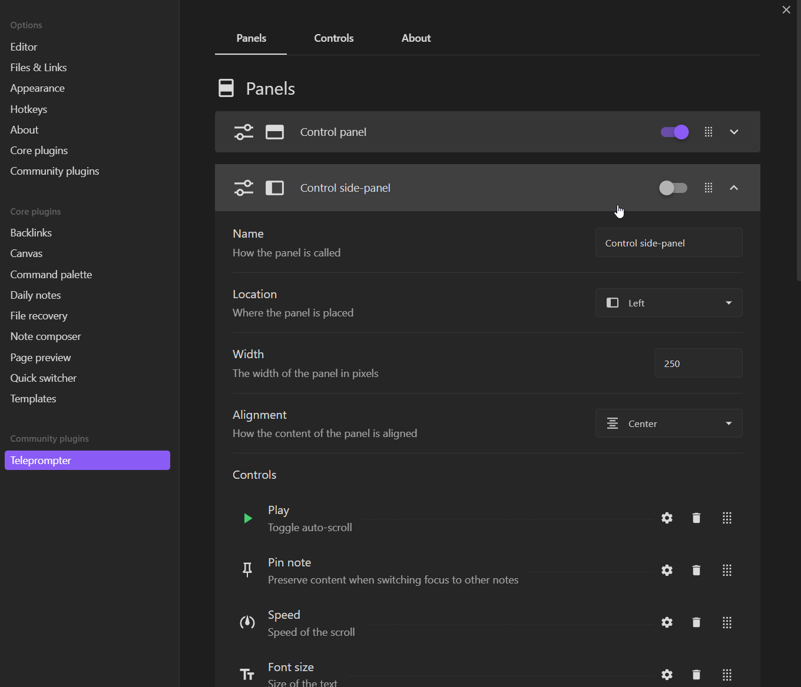

</details>

### Page minimap

<details>
  <summary>Displays a minimap of the content for easy navigation and better context awareness.</summary>

---

Settings:
- Name: displayed name (default: "Page minimap")
- Location: where the panel is placed (default: "Right")
    - Left
    - Right
- Width: width of the panel (default: 156 pixels)
- Alignment: alignment of the panel (default: "Center"),
    - Default
    - Center
    - Left
    - Right

---

Demo:


</details>

### Eyeline indicator

<details>
  <summary>Displays a visual cue that helps in maintaining constant eye focus in a single place and a steady reading flow.</summary>

---

Settings:
- Name: displayed name (default: "Eyeline indicator")
- Location: where the panel is placed (default: "Left")
    - Left
    - Right
- Width: width of the panel (default: 48 pixels)
- Position: indicator's offset from top in % (default: 20%)
- Background color: color of the panel's background (default: "Default")
    - Default
    - Follow content
    - Custom
- Color: color of the indicator (default: Obsidian's text color)

---

Demo:

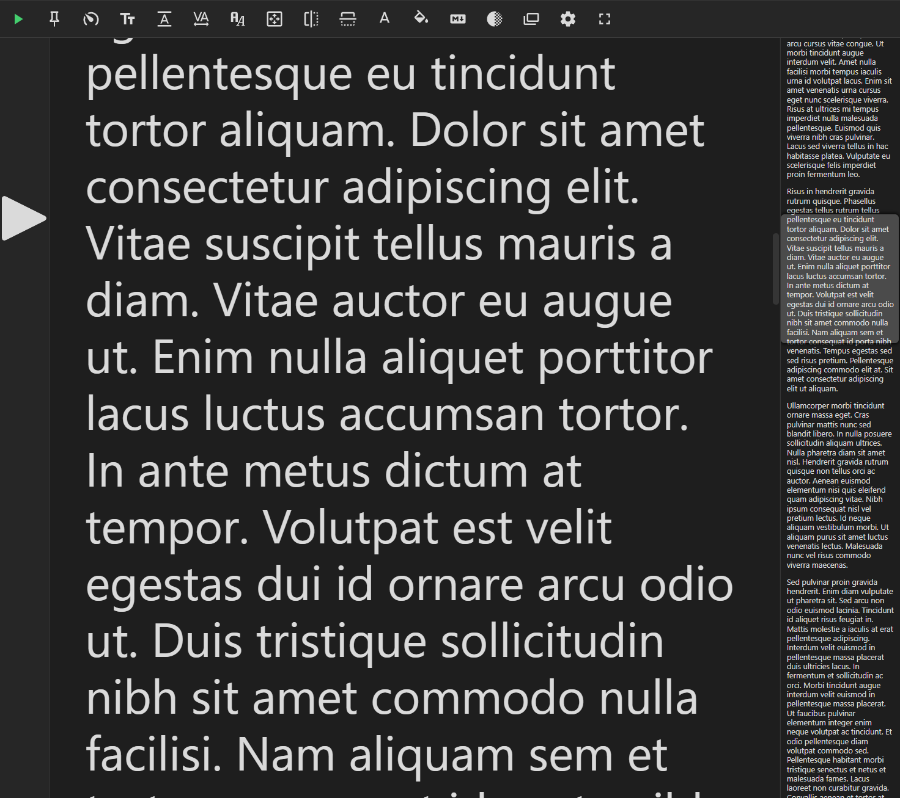

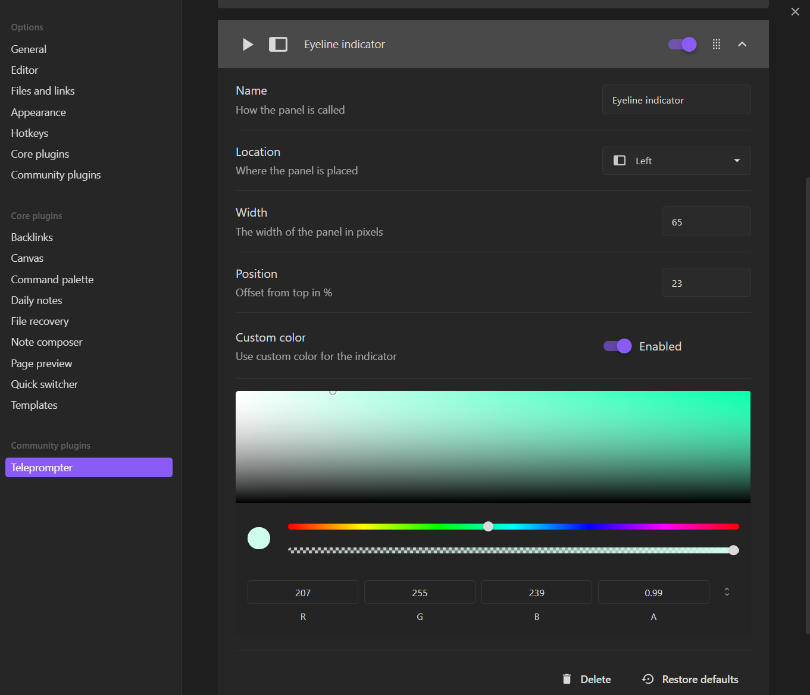

</details>

## Hotkeys

Use hotkeys for all possible actions within the Teleprompter window. 
In total, the plugin provides **73 commands** that can be mapped to hotkeys.

### Controls hotkeys

Controls provide commands that are specific to their functionality. See the detailed description of the control you're interested in to learn what commands it provides.

### Content hotkeys

- Scroll to top (ID: content:scroll-to-top)
- Scroll to bottom (ID: content:scroll-to-bottom)
- Scroll up 50 pixels (ID: content:scroll-up)
- Scroll down 50 pixels (ID: content:scroll-down)

### Additional hotkeys

#### Open teleprompter for current note
- Open teleprompter in sidebar (ID: open-app:sidebar)
- Open teleprompter in a new tab (ID: open-app:new-tab)
- Open teleprompter in a new window (ID : open-app:new-window)

#### Select a file to open in teleprompter
- Open file in sidebar and pin it (ID: open-app:sidebar:file)
- Open file in a new tab and pin it (ID: open-app:new-tab:file)
- Open file in a new window and pin it (ID: open-app:new-window:file)

#### Input arbitrary text to open in teleprompter
- Open arbitrary text in sidebar and pin it (ID: open-app:sidebar:text)
- Open arbitrary text in a new tab and pin it (ID: open-app:new-tab:text)
- Open arbitrary text in a new window and pin it (ID: open-app:new-window:text)

#### Other
- Close teleprompter (ID: close)

## API
You can control some of the plugin's features programmatically using the API. 
The API is accessible through the `api` object, 
available in the plugin's instance within Obsidian, 
through the `app.plugins.plugins.teleprompter` object.

### Methods

#### open(params)

Signature
```
open: ({ 
  file?: string, // path to the file to display in the teleprompter
  content?: string, // content to display in the teleprompter (overrides `file` if both are provided)
  placement?: 'sidebar' | 'tab' | 'window', // where to open the teleprompter window
  pin?: boolean, // whether to pin the note after opening it (unpin if `false`)
  play?: boolean, // whether to start auto-scrolling (stop if `false`)
  countdown?: number // delay in seconds before starting auto-scrolling
}) => void
```
Example usage:
```
app.plugins.plugins.teleprompter.open({
  content: "Hello, world!",
  placement: "window",
  pin: true,
  play: true,
  countdown: 5
});
```

#### close()
Close the teleprompter window.

## URI
The plugin registers the `obsidian://teleprompter:open` protocol handler, 
which can be used to open the teleprompter window for a specific file or content.
The handler accepts the same parameters as the `open` method described in the API section above.
The only difference is that boolean values should be passed as strings:
- 'false', '0', 'no', 'off' for `false`
- everything else for `true`

Example URL:
```
obsidian://teleprompter:open?file=My%20Note.md&placement=window&pin=no&play=yes&countdown=5
```

## Installation

### Quick installation

Click [HERE](https://obsidian.md/plugins?id=teleprompter) to open the installation page in Obsidian.  
For details see the [official installation instructions](https://help.obsidian.md/Extending+Obsidian/Community+plugins).

### Manual installation

1. Download the latest `obsidian-teleprompter.zip` from the latest [Github Release](https://github.com/lumetrium/obsidian-teleprompter/releases)
2. Extract `obsidian-teleprompter` folder from the zip
   to your vault's plugins folder `<vault>/.obsidian/plugins/` (note that `.obsidian` folder may be hidden by default)
3. Restart Obsidian
4. Open **Settings** -> **Community plugins** and activate **Teleprompter**

For details see [the forum](https://forum.obsidian.md/t/plugins-mini-faq/7737).

## Disclosures

In accordance with [Obsidian's developer policies](https://docs.obsidian.md/Developer+policies), it is required to transparently disclose the presence of any static ads, such as banners and pop-up messages, within the plugin's interface.

This plugin includes a single [static ad](./assets/screenshots/settings-about.png), which is accessible exclusively on the "About" page within the settings. The ad is a link to a [project](https://lumetrium.com/definer) developed by the same author responsible for this plugin. It's important to emphasize that there is no involvement of any third-party advertising.

## Recommendations

Check out this browser extension made by the same author:

<a href="https://chromewebstore.google.com/detail/definer-popup-dictionary/noagjioaihamoljcbelhdlldnmlgnkon?utm_source=teleprompter&utm_medium=referral&utm_content=readme">
  
</a>

**[Definer - Popup Dictionary & Translator](https://chromewebstore.google.com/detail/definer-popup-dictionary/noagjioaihamoljcbelhdlldnmlgnkon?utm_source=teleprompter&utm_medium=referral&utm_content=readme)**  
Instant definitions, translations, and search results for words and phrases you select or type.
